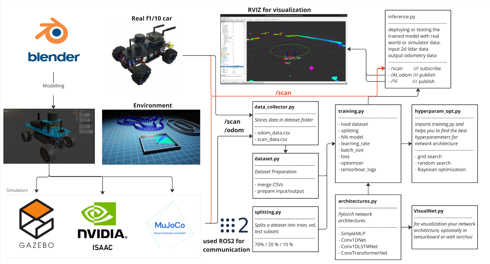
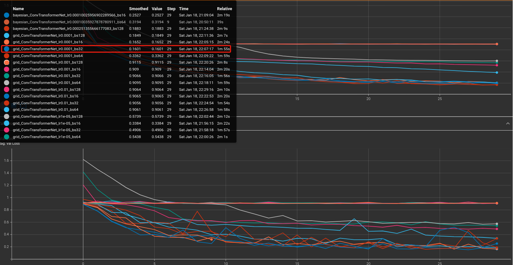
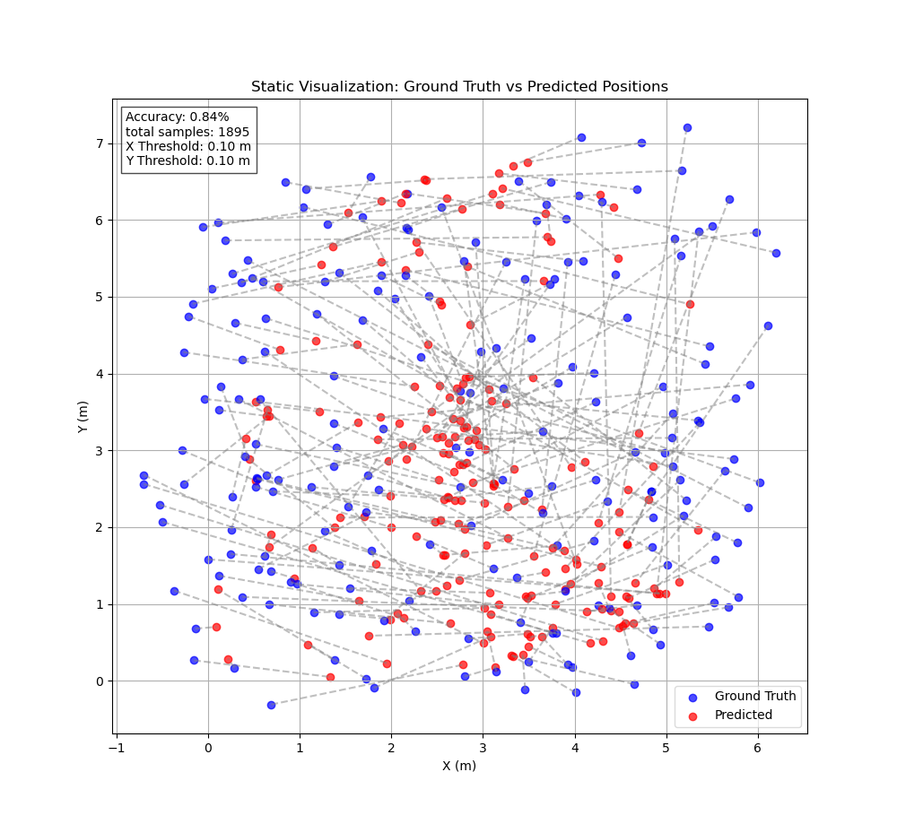
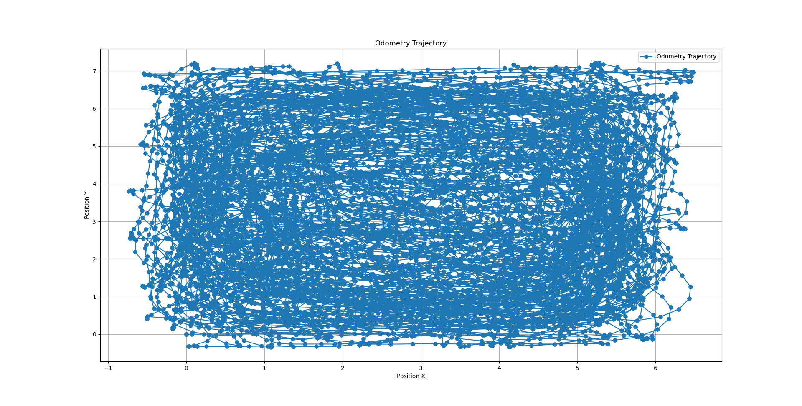

## 🌐 Language Selection 语言选择

- 🇬🇧 [English Version](README.md)
- 🇨🇳 [简体中文版](README_CN.md)
# Deep 2D LiDAR Localization

## About the Project

This project focuses on localization using only 2D LiDAR scan point clouds, leveraging deep learning techniques to achieve precise position estimation. It aims to serve as a robust solution for robotics applications where minimal sensor inputs are available.

---

## Getting Started

### Prerequisites

Ensure you have Python 3.10 or later installed. The project has been tested on Python 3.10.

### Clone the Repository

To clone the repository, run:

```bash
git clone https://github.com/donymorph/deep_2Dlidar_localization.git
cd deep_2Dlidar_localization
```

### Create an Environment

You can use any of the following methods to create a virtual environment:

#### Option 1: Using Built-in Python Module (`venv`)

```bash
python3 -m venv myenv
source myenv/bin/activate  # Linux/Mac
myenv\Scripts\activate   # Windows
```

#### Option 2: Using `virtualenv`

```bash
pip install virtualenv
virtualenv myenv
source myenv/bin/activate  # Linux/Mac
myenv\Scripts\activate   # Windows
```

#### Option 3: Using `conda`

```bash
conda create --name myenv python=3.10
conda activate myenv
```

### Install Dependencies

Once the environment is activated, install the required packages:

```bash
pip install -r requirements.txt
```

---

## Project Structure

The repository is organized as follows:

```
.
├── architectures/        # Contains deep learning models (e.g., MLP, Transformers)
├── dataset.py            # Dataset loader for LiDAR and odometry CSV files
├── training.py           # Main training script
├── hyperparam_opt.py     # Hyperparameter optimization scripts
├── splitting.py          # Dataset splitting utility
├── README.md             # Project documentation
├── requirements.txt      # Dependencies
├── dataset/              # Folder for storing dataset CSV files
│   ├── odom_data_*.csv   # Odometry data
│   ├── scan_data_*.csv   # LaserScan data
└── models/               # Trained models saved here
```

---

## Usage

### 1. Data Collection

To collect LiDAR and odometry data, run the `data_collector.py` script using Python:

```bash
python3 data_collector.py 
         ///or
ros2 run deep_2Dlidar_localization data_collector_node
```

The script saves collected data as `odom_data_*.csv` and `scan_data_*.csv` in the `dataset/` directory. but make sure you have installed ROS2 humble version. it waits `/odom` and `/scan` data then starts recording.

### 2. Training the Model

To train the model, run:

```bash
python3 training.py
```

Key options for the script include:

- **`odom_csv`**: Path to the odometry CSV file
- **`scan_csv`**: Path to the LiDAR CSV file
- **`model_choice`**: Choose from `SimpleMLP`, `DeeperMLP`, `Conv1DNet`, `Conv1DLSTMNet`, `ConvTransformerNet`
- **`batch_size`**: Training batch size
- **`lr`**: Learning rate
- **`epochs`**: Number of training epochs

Example:

```bash
python3 training.py #--odom_csv odom_data.csv --scan_csv scan_data.csv --model_choice ConvTransformerNet --batch_size 64 --lr 1e-4 --epochs 20
```

### 3. Hyperparameter Optimization

To run hyperparameter optimization, execute:

```bash
python3 hyperparam_opt.py
```

You can explore Grid Search, Random Search, and Bayesian Optimization using the `hyperparam_opt.py` script.

---

## Results and Visualization

Training progress is logged using TensorBoard. To view training metrics:

```bash
tensorboard --logdir tensorboard_logs/
```

Access the TensorBoard UI in your browser at `http://localhost:6006`.


 After training this plot will pop up,  it tells how good and accurate your trained model, it takes test sample data and calculates the accuracy. the task is minimizing the distance between ground thruth and predicted values. threshold is 10 cm if the distance between ground truth and predicted point within 10 cm, its considered valid otherwise accumulates error. in case you reached 100% accuracy you can decrease the threshold, make it 0.01 or even smaller number. but careful not to overfit the model. for plotting around 200 sample points is used, for calculating the accuracy all samples are passed. 
 
 demo picture


after training you can even further test the model with actual dataset data, animated version and save as mp4
```bash
python3 testing_model.py # specify model_path and model_choice in the script
```
<video controls src="images/fig.mp4" title="Title"></video>

## Visual Data distribution



---

## Requirements

See `requirements.txt` for a list of dependencies. To regenerate the file:

```bash
pip freeze > requirements.txt
```

---
## Contributions

We welcome contributions, issues, and feature requests to help improve this project. Here's how you can contribute:

1. **Fork the Repository**:

   - Click the "Fork" button on the top right corner of this repository's page to create your own copy.

2. **Clone Your Fork**:

   - Clone your fork to your local machine:
     ```bash
     git clone https://github.com/your-username/deep_2Dlidar_localization.git
     cd deep_2Dlidar_localization
     ```

3. **Create a New Branch**:

   - Create a new branch for your feature or bug fix:
     ```bash
     git checkout -b feature-or-bugfix-name
     ```

4. **Make Changes**:

   - Edit files and add your changes.
   - Ensure your code follows the project's style and guidelines.
   - Test your changes thoroughly.

5. **Commit Changes**:

   - Add and commit your changes:
     ```bash
     git add .
     git commit -m "Description of your changes"
     ```

6. **Push Changes to Your Fork**:

   - Push the changes to your fork:
     ```bash
     git push origin feature-or-bugfix-name
     ```

7. **Submit a Pull Request**:

   - Go to the original repository and click "Compare & pull request."
   - Provide a clear description of your changes and why they are necessary.

8. **Collaborate**:

   - Discuss feedback and make any necessary updates to your pull request.

We look forward to your contributions!

---

## License

This project is licensed under the MIT License. See the `LICENSE` file for details.

---

## Acknowledgments

Special thanks to `Zhejiang University of Technology` and the open-source community for providing the tools and resources that made this project possible.

