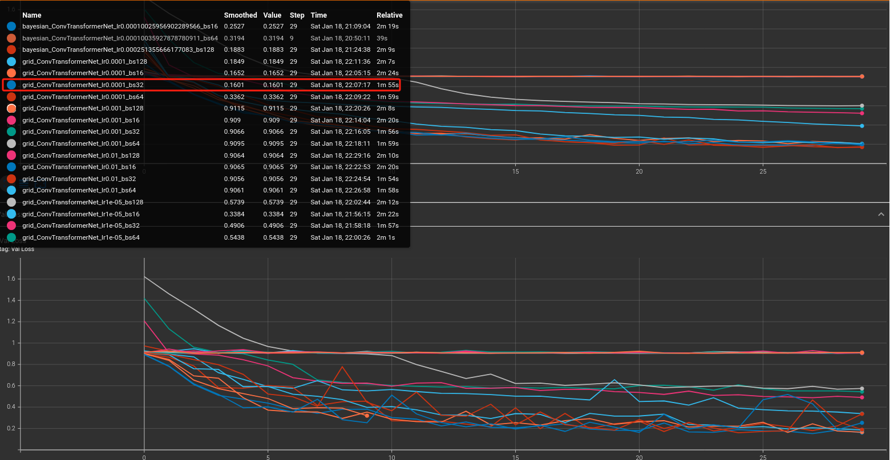
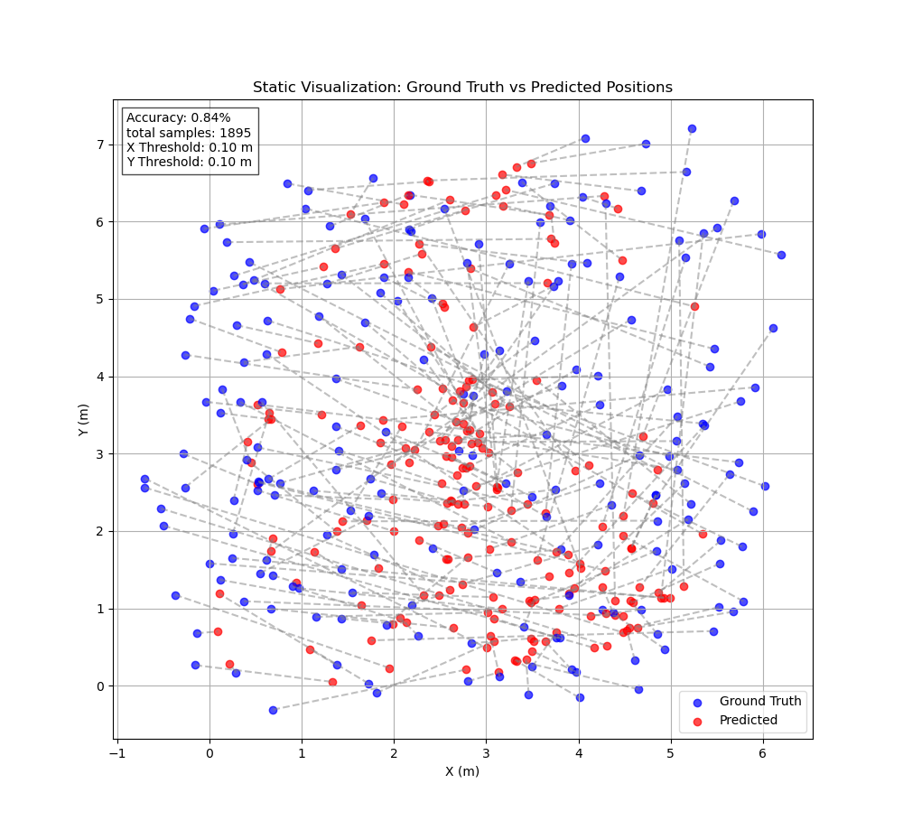
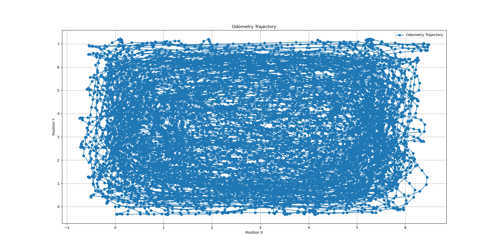

## 🌐 Language Selection 语言选择

- 🇬🇧 [English Version](README.md)
- 🇨🇳 [简体中文版](README_CN.md)
# 深度 2D LiDAR 定位

## 关于项目

该项目专注于使用 2D LiDAR 扫描点云进行定位，利用深度学习技术实现精准的位置估计。这旨在为仅有有限传感器输入的机器人应用提供一个稳健的解决方案。


---

## 快速开始

### 前提条件

确保已安装 Python 3.10 或更高版本。本项目已在 Python 3.10 上进行测试。

### 克隆仓库

运行以下命令克隆仓库：
```bash
git clone https://github.com/donymorph/deep_2Dlidar_localization.git
cd deep_2Dlidar_localization
```

### 创建环境

您可以使用以下任何一种方法创建虚拟环境：

#### 选项 1: 使用内置 Python 模块 (`venv`)
```bash
python3 -m venv myenv
source myenv/bin/activate  # Linux/Mac
myenv\Scripts\activate   # Windows
```

#### 选项 2: 使用 `virtualenv`
```bash
pip install virtualenv
virtualenv myenv
source myenv/bin/activate  # Linux/Mac
myenv\Scripts\activate   # Windows
```

#### 选项 3: 使用 `conda`
```bash
conda create --name myenv python=3.10
conda activate myenv
```

### 安装依赖

激活环境后，安装所需的软件包：
```bash
pip install -r requirements.txt
```

---

## 项目结构

该仓库的组织结构如下：

```
.
├── architectures/        # 深度学习模型（如 MLP，Transformers）
├── dataset.py            # LiDAR 和里程计 CSV 文件加载器
├── training.py           # 主训练脚本
├── hyperparam_opt.py     # 超参数优化脚本
├── splitting.py          # 数据集拆分工具
├── README.md             # 项目文档
├── requirements.txt      # 依赖列表
├── dataset/              # 存储数据集 CSV 文件的文件夹
│   ├── odom_data_*.csv   # 里程计数据
│   ├── scan_data_*.csv   # 激光扫描数据
└── models/               # 保存的训练模型
```

---

## 使用方法

### 1. 数据收集

使用 `data_collector.py` 脚本收集 LiDAR 和里程计数据：
```bash
python3 data_collector.py 
         /// 或者
ros2 run deep_2Dlidar_localization data_collector_node
```

该脚本将采集的数据保存为 `odom_data_*.csv` 和 `scan_data_*.csv`，存储在 `dataset/` 目录中。但请确保已安装 ROS2 Humble 版本。脚本会等待 `/odom` 和 `/scan` 数据并开始记录。

### 2. 训练模型

运行以下命令训练模型：
```bash
python3 training.py
```

脚本的主要选项包括：
- **`odom_csv`**: 里程计 CSV 文件的路径
- **`scan_csv`**: LiDAR CSV 文件的路径
- **`model_choice`**: 可选模型包括 `SimpleMLP`，`DeeperMLP`，`Conv1DNet`，`Conv1DLSTMNet`，`ConvTransformerNet`
- **`batch_size`**: 训练批量大小
- **`lr`**: 学习率
- **`epochs`**: 训练轮数

示例：
```bash
python3 training.py #--odom_csv odom_data.csv --scan_csv scan_data.csv --model_choice ConvTransformerNet --batch_size 64 --lr 1e-4 --epochs 20
```

### 3. 超参数优化

运行以下命令执行超参数优化：
```bash
python3 hyperparam_opt.py
```

您可以使用 `hyperparam_opt.py` 脚本探索网格搜索、随机搜索和贝叶斯优化。

---

## 结果与可视化

训练进度通过 TensorBoard 记录。查看训练指标：
```bash
tensorboard --logdir tensorboard_logs/
```

在浏览器中访问 TensorBoard 界面：http://localhost:6006。



训练结束后，会弹出这个图，它会告诉你训练的模型有多好和准确，它会获取测试样本数据并计算准确度。任务是最小化地面真实值和预测值之间的距离。阈值为 10 厘米，如果地面真实值和预测点之间的距离在 10 厘米以内，则认为有效，否则会累积误差。如果达到 100% 的准确度，你可以降低阈值，使其成为 0.01 或更小的数字。但要小心不要过度拟合模型。绘制时使用大约 200 个样本点，计算准确度时所有样本都通过。
 
演示图片


训练后，你甚至可以使用实际数据集数据、动画版本进一步测试模型并保存为 mp4
```bash
python3 testing_model.py # 指定 model_path 和 model_choice 在脚本中
```
<video controls src="images/fig.mp4" title="Title"></video>

## 可视化数据分布



---

## 依赖

参阅 `requirements.txt` 获取依赖列表。重新生成文件：
```bash
pip freeze > requirements.txt
```

---

## 贡献

我们欢迎任何贡献、问题和功能请求，以帮助改进此项目。以下是贡献的步骤：

1. **Fork 仓库**：
   - 点击本仓库页面右上角的“Fork”按钮，创建您自己的副本。

2. **克隆您的 Fork**：
   - 克隆您的 Fork 到本地机器：
     ```bash
     git clone https://github.com/your-username/deep_2Dlidar_localization.git
     cd deep_2Dlidar_localization
     ```

3. **创建新分支**：
   - 为您的功能或错误修复创建新分支：
     ```bash
     git checkout -b feature-or-bugfix-name
     ```

4. **进行更改**：
   - 编辑文件并添加您的更改。
   - 确保您的代码符合项目的风格和指南。
   - 彻底测试您的更改。

5. **提交更改**：
   - 添加并提交您的更改：
     ```bash
     git add .
     git commit -m "描述您的更改"
     ```

6. **将更改推送到您的 Fork**：
   - 将更改推送到您的 Fork：
     ```bash
     git push origin feature-or-bugfix-name
     ```

7. **提交 Pull Request**：
   - 转到原始仓库并点击“Compare & pull request”。
   - 提供清晰的更改描述以及其必要性。

8. **协作**：
   - 讨论反馈并对您的 Pull Request 进行必要的更新。

我们期待您的贡献！

---

## 许可证

此项目根据 MIT 许可证授权。详情请参阅 `LICENSE` 文件。

---

## 致谢

特别感谢 `浙江工业大学` 和开源社区提供的工具和资源，使得本项目成为可能。

